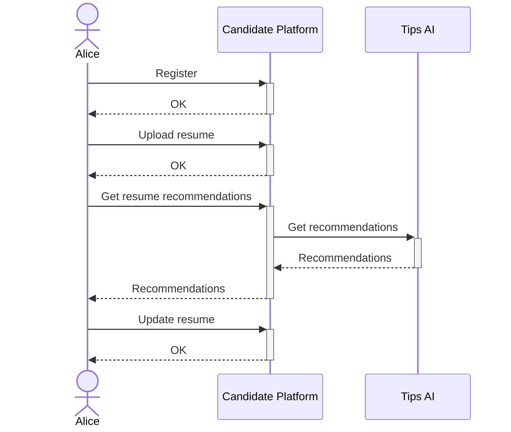
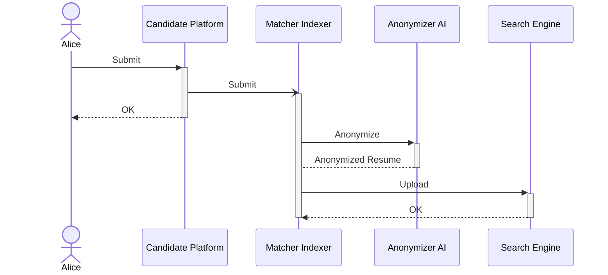
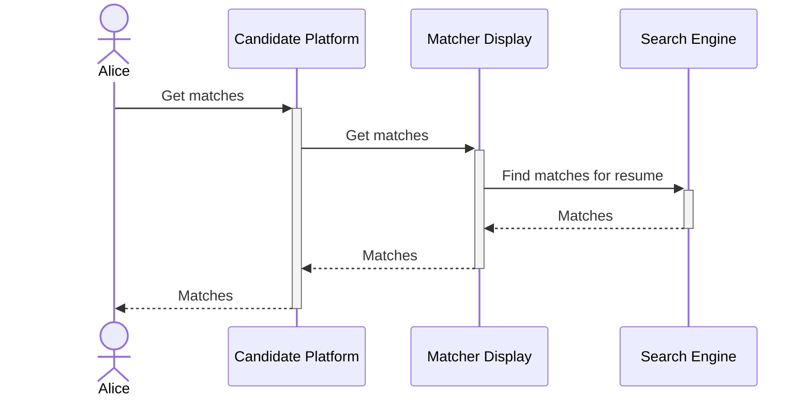
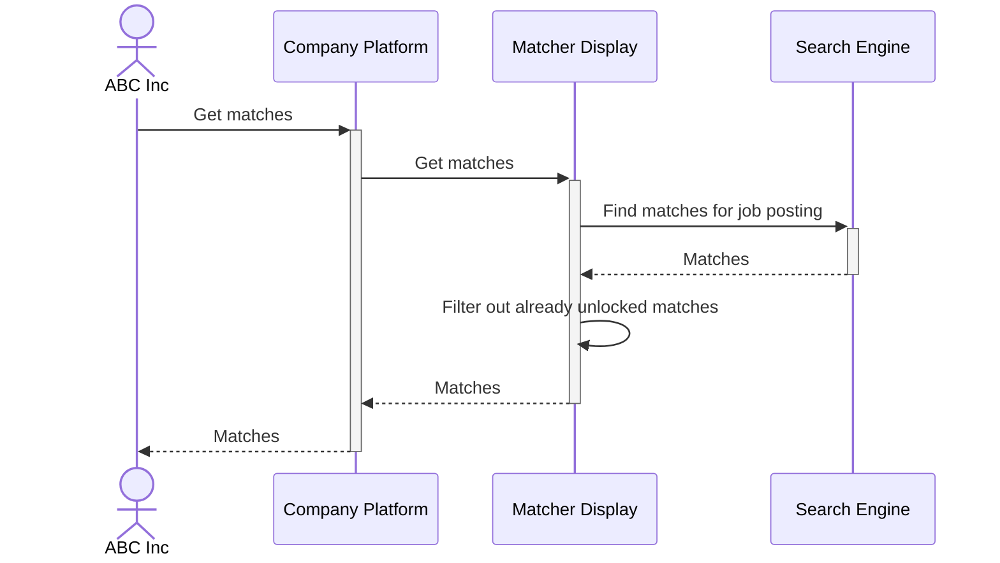
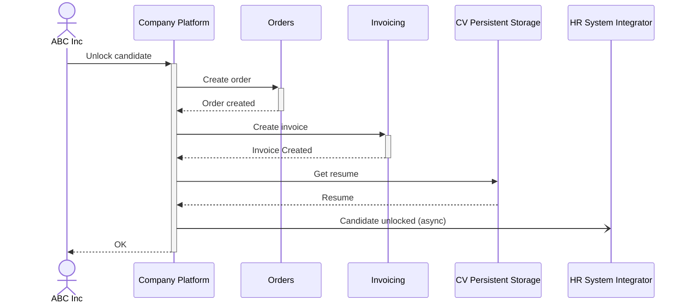
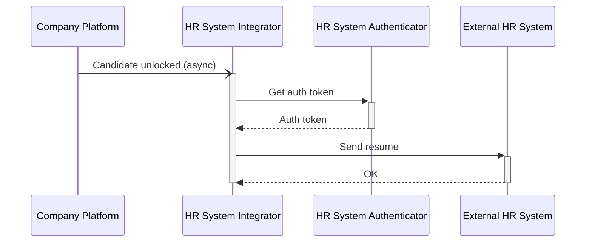

# Resume Uploading and AI-Powered Resume Enhancement Suggestions

- Manage resume versions, allowing candidates to update or replace their resume as their experience grows.
- After uploading a resume, ClearView uses AI to analyze the document and provide personalized recommendations for improvement.
- Recommendations for optimizing resume format, keyword usage, and content relevance to specific job descriptions.
- Skill gap analysis to highlight areas where the candidate may need further development or certifications.

# Automatic Resume Anonymization

- Hide personally identifiable information (PII) such as name, gender, age, address, and other data that may lead to unconscious bias during the hiring process.
- Automatic detection and removal of PII from resumes.

# Candidate-Job Matching

- Advanced algorithms to match candidates with jobs based on their skills, experience, and job descriptions provided by employers.
- Matches are ranked by relevance, highlighting top candidates for each job.

# Job Search and Recommendations

- Candidates can search for jobs using various filters and receive AI-powered recommendations for roles that best align with their profiles.

# Employer Access to Anonymized Resumes

- Employers can search for candidates using their anonymized resumes. They can view the qualifications and experiences of candidates without any biases related to personal information. 
- Employers only see objective data (e.g., education, skills, work history) until they decide to unlock the candidate’s full profile after a match is made.

# Resume Unlocking and Full Profile Access

- Employer payments for unlocking resumes are handled through the billing system.
- Once unlocked, the employer can view the candidate’s contact information and other PII.

**Resume Unlocking**

**Resume Delivery**

# Notifications and Alerts

- Candidates receive alerts when a new job match is found or when an employer unlocks their profile. 
- Employers are notified when new candidate matches appear or when a resume update improves the relevance of a match. 
- Multiple channels for notifications, including email and mobile push notifications.

# Analytics and Reporting

- Detailed analytics on candidate engagement, match quality, and hiring outcomes.
- Analytics on business KPIs

# Survey and Feedback Mechanism

- Post-hiring surveys for both candidates and employers to share feedback.
- Anonymous feedback options to ensure transparency and unbiased responses.

# Data Privacy and Security

- The platform ensures that all candidate data, especially personally identifiable information, is encrypted and only accessible under strict controls.
- Secure storage of resumes and profile information in compliance with GDPR and other data protection regulations.
- Audit trails for all data access, ensuring transparency and accountability.
